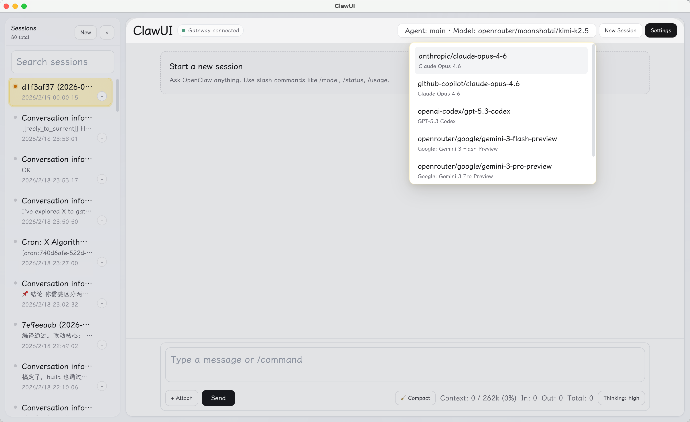
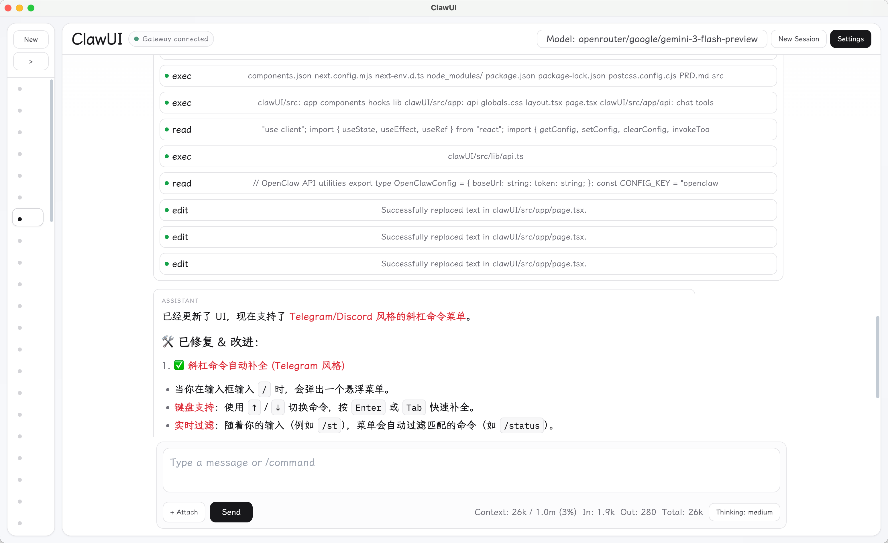

<p align="center">
  <h1 align="center">ClawUI</h1>
  <p align="center">A modern, ChatGPT-style web & desktop client for <a href="https://github.com/openclaw/openclaw">OpenClaw Gateway</a>.</p>
</p>

<p align="center">
  <a href="#quick-start">Quick Start</a> •
  <a href="#features">Features</a> •
  <a href="#desktop">Desktop App</a> •
  <a href="#configuration">Configuration</a> •
  <a href="LICENSE">License</a>
</p>



## Why ClawUI?

OpenClaw's built-in webchat is functional but minimal. ClawUI gives you a full-featured chat interface — session management, rich rendering, tool call inspection, keyboard shortcuts, and deep UI customization — all connecting directly to your Gateway via WebSocket. No extra backend needed.

## Quick Start

> **Prerequisites:** Node.js ≥ 22, npm ≥ 10, a running [OpenClaw Gateway](https://docs.openclaw.ai/gateway)

```bash
git clone https://github.com/Kt-L/clawUI.git
cd clawUI
npm install
npm run dev
```

Open the URL printed by Vite (default `http://localhost:5178`), go to **Settings**, and enter your Gateway URL + token/password. That's it.

## Features

**Chat**
- Streaming AI responses with live thinking animation
- Markdown, syntax-highlighted code blocks, LaTeX math (KaTeX), and tables
- Tool call timeline — collapsed by default, expandable for full args & output
- File & image attachments with auto-compression and size estimation
- Reply-done sound notifications (built-in tones or custom audio)

**Sessions**
- Create, search, switch, and delete sessions from the sidebar
- History pagination with incremental loading
- Multi-agent support — create sessions bound to specific agents

**Slash Commands**
- `/status` `/models` `/model` `/think` `/compact` `/abort` `/new` `/reset` and more
- Autocomplete popup with keyboard navigation (↑↓ + Enter/Tab)

**Shortcuts**
- `Ctrl/⌘ + D` — toggle sidebar
- `Ctrl/⌘ + E` — new session
- Up to 5 custom model shortcuts (model + thinking level combo)
- Up to 5 custom agent-session shortcuts

**UI Customization**
- Font family, size, line height, content width
- Color schemes and themes
- Settings schemes — save & switch between presets
- All changes apply instantly, persisted in localStorage



## Desktop

ClawUI supports Electron packaging for a native desktop experience with local image resolution.

```bash
npm run build
npm run desktop:pack          # unpacked app for current OS
npm run desktop:dist:mac      # unsigned macOS .dmg + .zip
```

See [DESKTOP.md](DESKTOP.md) for details on macOS Gatekeeper and first-launch instructions.

## Configuration

| Variable | Default | Description |
|----------|---------|-------------|
| `PORT` | `5178` | Vite dev server port |
| `CLAWUI_IMAGE_PROXY_PORT` | `3000` | Local image proxy port (desktop) |
| `OPENCLAW_WORKSPACE_DIR` | auto | Override workspace path for desktop runtime |

Gateway connection settings (URL, token, password) are configured in the UI under **Settings**.

## Project Structure

```
src/           React app, components, and client logic
src/lib/       Gateway client, markdown renderer, UI settings, utilities
electron/      Desktop main/preload bridge, local image protocol
scripts/       Runtime and environment checks
```

## Disclaimer & Status

⚠️ This project is an AI-assisted rapid development experiment.

Because it was built quickly with the help of AI, the codebase may contain bugs, edge cases, or unoptimized architecture. It is published strictly for learning, inspiration, and reference purposes.

## License

[MIT](LICENSE)
