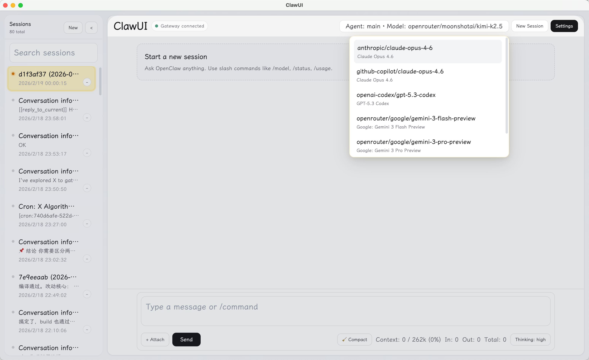
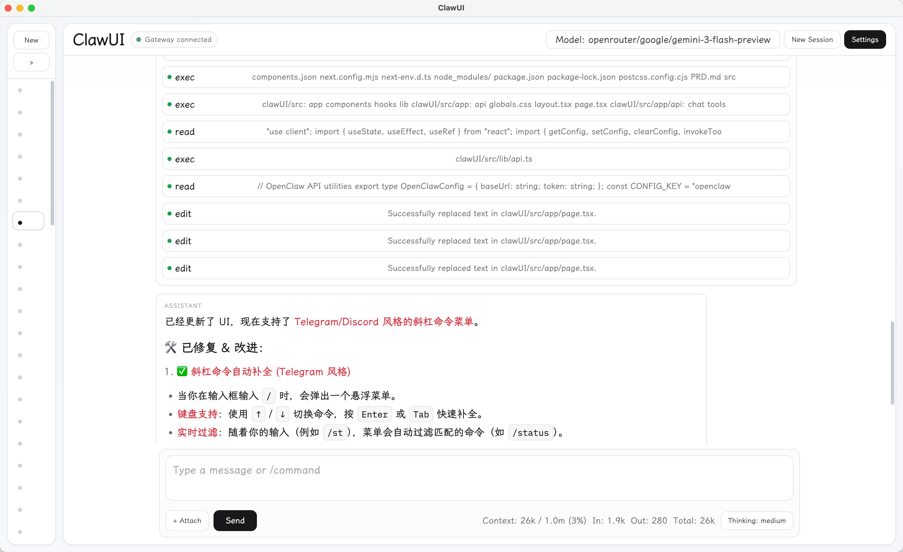

<p align="center">
  <h1 align="center">ClawUI</h1>
  <p align="center">A modern, ChatGPT-style web & desktop client for <a href="https://github.com/openclaw/openclaw">OpenClaw Gateway</a>.</p>
</p>

<p align="center">
  <a href="#quick-start">Quick Start</a> •
  <a href="#features">Features</a> •
  <a href="#file-manager">File Manager</a> •
  <a href="#demo">Demo</a> •
  <a href="#desktop-app">Desktop App</a> •
  <a href="#configuration">Configuration</a> •
  <a href="LICENSE">License</a>
</p>



## Why ClawUI?

OpenClaw's built-in webchat is functional but minimal. ClawUI gives you a full-featured chat interface — session management, rich rendering, tool call inspection, keyboard shortcuts, file management, and deep UI customization — all connecting directly to your Gateway via WebSocket. No extra backend needed.

## Quick Start

> **Prerequisites:** Node.js ≥ 22, npm ≥ 10, a running [OpenClaw Gateway](https://docs.openclaw.ai/gateway)

```bash
git clone https://github.com/Kt-L/clawUI.git
cd clawUI
npm install
npm run dev
```

Open the URL printed by Vite (default `http://localhost:5178`), go to **Settings**, and enter your Gateway URL + token/password. That's it.

## Features

**Chat**
- Streaming AI responses with live thinking animation
- Markdown, syntax-highlighted code blocks, LaTeX math (KaTeX), and tables
- Tool call timeline — collapsed by default, expandable for full args & output; running tools show a pulsing status dot
- File & image attachments with visual preview cards, auto-compression, and size estimation
- Smart text file embedding — text-based attachments (source code, config, markdown, etc.) are decoded and sent inline as `<file>` tags for better model context; binary files are labeled accordingly
- OpenClaw envelope stripping — user messages are automatically cleaned of gateway-injected metadata (system events, conversation info / sender metadata, timestamps) for a cleaner chat display
- Reply-done sound notifications (built-in tones or custom audio)
- Graceful WebSocket error handling — invalid gateway URLs no longer crash the connection loop

**Sessions**
- Create, search, switch, and delete sessions from the sidebar
- Session titles and previews are sanitized (envelope metadata stripped) for cleaner display
- History pagination with incremental loading
- Multi-agent support — create sessions bound to specific agents
- Delete spinner animation with visual feedback

**File Manager**
- Built-in file browser accessible from the sidebar — switch between chat and files with a 3D flip animation
- Browse, preview, edit, upload, download, create folders, and delete files
- Configurable root directories via `~/.openclaw/clawui-fs.json`
- Preview support for Markdown (rendered), text/code files, images, and PDFs
- In-browser text file editing with Cmd/Ctrl+S save and unsaved-change indicator
- Drag-and-drop file upload with visual drop overlay
- Sort by name, size, or date; toggle hidden files
- Breadcrumb navigation with root tabs
- Security: all paths are validated and scoped to configured roots (symlink-aware)
- Works in both web (Vite dev server plugin) and desktop (custom `claw-fs://` protocol)
- Remote file server support — configure a File Server URL in Settings for cross-device access

**Frost & Glow Visual Theme**
- Glassmorphism-inspired design with warm-yellow accent palette and refined design tokens
- 3D perspective tilt on session and file cards — hover to see the entire card (border, background, shadow) respond to cursor position with specular glow highlights
- Directional coin-flip animation on session card click — the card flips from the side you clicked
- 3D sidebar flip transition between chat and file views
- Staggered "drawer pop" fly-in animations when switching sessions
- Composer launch impulse and chat thread physics on send
- Smooth sidebar slide-in/collapse, menu entrance, and modal backdrop transitions
- Custom text selection styling with accent-tinted highlight
- Connection status dots with subtle glow rings
- Copy button press animation with success state

**Slash Commands**
- `/status` `/models` `/model` `/think` `/compact` `/abort` `/new` `/reset` and more
- Autocomplete popup with keyboard navigation (↑↓ + Enter/Tab)

**Shortcuts**
- Configurable app action shortcuts — Toggle Sidebar and New Session with full modifier customization (Cmd/Ctrl/Alt/Shift + key), enable/disable per action
- Up to 5 custom model shortcuts (model + thinking level combo)
- Up to 5 custom agent-session shortcuts

**UI Customization**
- Font family, size, line height, content width
- Color schemes and themes
- Animation toggle — enable or disable all motion effects (including sidebar flip and card tilt)
- Settings schemes — save & switch between presets
- All changes apply instantly, persisted in localStorage



## File Manager

The file manager provides a full file browser alongside the chat interface. Click the **Files** button in the sidebar to switch views.

**Setup:** By default, ClawUI serves files from `~/.openclaw/workspace`. To customize accessible directories, create `~/.openclaw/clawui-fs.json`:

```json
{
  "roots": [
    { "label": "Workspace", "path": "/Users/you/.openclaw/workspace" },
    { "label": "Projects", "path": "/Users/you/projects" }
  ]
}
```

**Desktop:** The file manager works natively via the `claw-fs://` protocol — no extra server needed.

**Remote access:** To browse files from a remote machine running the Vite dev server, set the **File Server URL** in Settings (e.g. `http://192.168.1.100:5178`).

## Demo

https://github.com/user-attachments/assets/ef7d17be-8a14-40d3-896e-f26839052041

> *Short walkthrough of the UI*

## Desktop App

ClawUI supports Electron packaging for a native desktop experience with local image resolution and file system access.

```bash
npm run build
npm run desktop:pack          # unpacked app for current OS
npm run desktop:dist:mac      # unsigned macOS .dmg + .zip
```

See [DESKTOP.md](DESKTOP.md) for details on macOS Gatekeeper and first-launch instructions.

### Download from Releases

Pre-built **unsigned** macOS desktop build is available on the [Releases](https://github.com/Kt-L/clawUI/releases) page.

> ⚠️ **This build is unsigned.** macOS Gatekeeper will block the app on first launch. To open it:
> 1. Right-click the app and choose **Open**.
> 2. Confirm the security prompt once.
>
> After the first launch, the app will open normally.

## Configuration

| Variable | Default | Description |
|----------|---------|-------------|
| `PORT` | `5178` | Vite dev server port |
| `CLAWUI_IMAGE_PROXY_PORT` | `3000` | Local image proxy port (desktop) |
| `OPENCLAW_WORKSPACE_DIR` | auto | Override workspace path for desktop runtime |

Gateway connection settings (URL, token, password) and File Server URL are configured in the UI under **Settings**.

## Project Structure

```
src/               React app, components, and client logic
src/components/    Chat view, session sidebar, file manager, settings modal
src/lib/           Gateway client, markdown renderer, UI settings, utilities
src/hooks/         Custom React hooks (e.g. useCardTilt for 3D tilt effect)
electron/          Desktop main/preload bridge, local image & file system protocols
scripts/           Runtime and environment checks
vite-fs-plugin.ts  Vite dev server plugin for file system REST API
```

## Disclaimer & Status

⚠️ This project is an AI-assisted rapid development experiment.

Because it was built quickly with the help of AI, the codebase may contain bugs, edge cases, or unoptimized architecture. It is published strictly for learning, inspiration, and reference purposes.

## License

[MIT](LICENSE)
