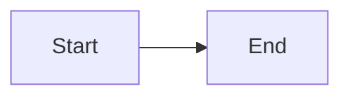
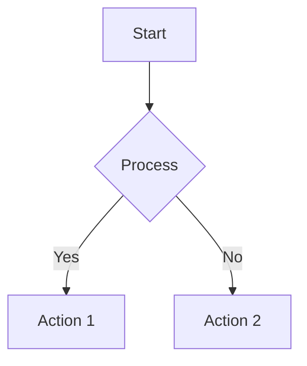
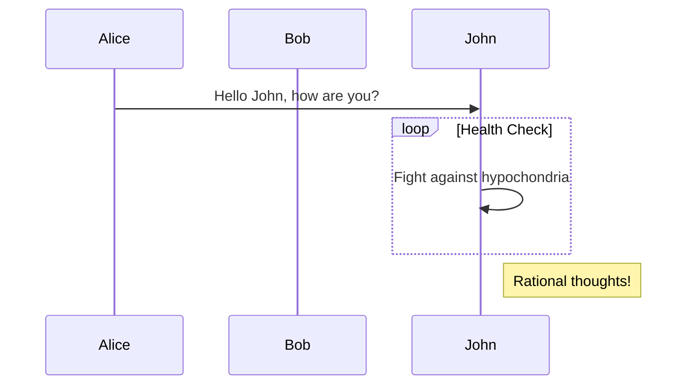
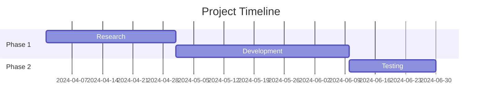
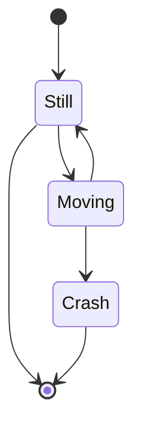

# Mermaid Diagram User Guide

## Overview

ClawUI now supports native mermaid.js diagram rendering in markdown code blocks.

## Getting Started

### Basic Usage

Wrap mermaid syntax in markdown code blocks with `mermaid` language identifier:

### Flowchart

### Sequence Diagram

### Gantt Chart

### State Diagram

## Supported Diagram Types

| Type | Markdown Syntax | Example |
|------|----------------|--------|
| Flowchart | `flowchart TD` or `flowchart LR` | [See above] |
| Sequence | `sequenceDiagram` | [See above] |
| Gantt | `gantt` | [See above] |
| State | `stateDiagram` or `stateDiagram-v2` | [See above] |
| ER (Entity-Relationship) | `erDiagram` | `erDiagram\n  CUSTOMER ||--o{ ORDER : places` |
| Mindmap | `mindmap` | `mindmap\n(root((Mermaid)))` |
| Pie | `pie` | `pie title Tasks\n"Done" : 70` |
| Journey | `journey` | `journey\ntitle My journey\nsection Go\n` |
| Git | `gitGraph` | `gitGraph\ncommit; commit` |

## Customization

### Dark Theme

Mermaid automatically uses ClawUI's dark theme via CSS variables (`--claw-panel-bg`, `--claw-text`, `--claw-border`).

### Light Theme Support

Light theme inherits automatically via mermaid's default styles.

## Troubleshooting

### Diagram Not Rendering

**Symptom:** Mermaid syntax shows as code block, no diagram appears.

**Solutions:**
1. Check correct language identifier: `\`\`\`mermaid` (not `\`\`\`md`)
2. Verify mermaid syntax is valid: https://mermaid.live/editor
3. Check dev console for JavaScript errors
4. Refresh dev server: Ctrl+R / Cmd+R

### Dark Theme Not Matching

**Symptom:** Diagram colors don't match ClawUI dark theme.

**Solution:** Mermaid uses `theme: "dark"` with CSS variable overrides. Check browser console to ensure CSS variables are loaded.

### Mobile Overflow

**Symptom:** Diagram causes horizontal scrollbar on mobile.

**Solution:** CSS includes `overflow: auto` and `min-width` constraints. Large diagrams may overflow (intended behavior). Try simplifying diagram for mobile.

### Performance Issues

**Symptom:** Page slow when rendering many diagrams.

**Solution:**
- Mermaid is debounced (100ms batch)
- Concurrent renders limited to max 3
- SVG caching enabled
- If persisting issues, report in GitHub issue: https://github.com/Kt-L/clawUI/issues

## Accessibility

Mermaid diagrams include:
- `aria-label` attributes
- Fallback text for screen readers
- Reduced motion preference support

## Resources

- Mermaid documentation: https://mermaid.js.org/
- Mermaid live editor: https://mermaid.live/
- ClawUI issues: https://github.com/Kt-L/clawUI/issues
