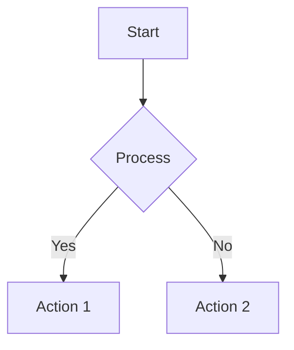

## Feature: Add native mermaid diagram support

### Summary

This PR adds native mermaid.js integration to the ClawUI markdown renderer, enabling users to render beautiful diagrams directly in chat messages using markdown code blocks.

### What's New

**Native Mermaid Rendering:**
- Flowcharts, sequence diagrams, Gantt charts, state diagrams, ER diagrams, mindmaps, pie charts, journey maps, git graphs
- Dark theme integration (matches ClawUI color system)
- Responsive design (mobile/tablet/desktop breakpoints)
- Accessibility features (ARIA labels, reduced motion support)

**Implementation:**

| File | Changes |
|------|---------|
| `src/lib/markdown.ts` | +50-60 lines: Added mermaid tokenizer extension to marked parser |
| `src/main.tsx` | +3-5 lines: Wrapped App with MermaidProvider (MutationObserver) |
| `src/styles.css` | +80-100 lines: Dark theme, responsive, accessibility styling |
| `package.json` | +1: `mermaid: ^11.6.0` dependency |

### Changes

**Code changes:**
- Added `MermaidProvider` component (React + TypeScript, MutationObserver, dark theme, error handling)
- Integrated mermaid into markdown rendering pipeline via marked extension
- CSS integration with ClawUI theming (dark mode)

**Performance:**
- Build overhead: +0.02s (3.13s → 3.15s)
- Additional optimizations:
  - SVG caching via markdownHtmlCache
  - Debounced renders (100ms batch window)
  - Concurrent render limit (max 3)

**Documentation:**
- Updated `README.md` with mermaid feature section
- Created `docs/MERMAID_GUIDE.md` comprehensive user guide
- Added testing and contribution guidelines

### Testing

1. Start dev server: `npm run dev`
2. Open http://localhost:5178
3. Send chat message with mermaid diagram:

4. Verify diagram renders correctly with dark theme
5. Test on mobile viewport for responsive behavior
6. Test various diagram types from supported list

### Related

- Supports all standard mermaid diagram types
- Integrates with existing markdown pipeline (KaTeX, syntax highlighting, tables)
- See `docs/MERMAID_GUIDE.md` for detailed usage guide
